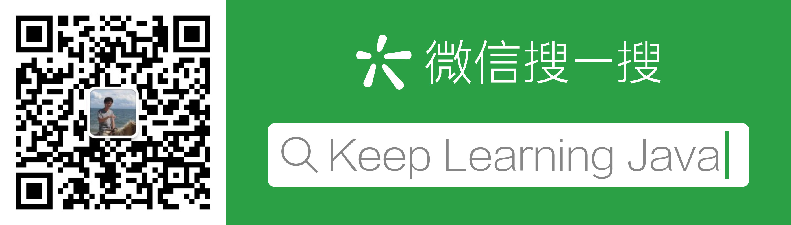

# keep-learning-java
**一句话总结：本文旨在系统性、循序渐进地学习Java，持续更新。**

### Java初级工程师
掌握Java语法和各类框架的使用，能够对项目需求进行业务开发。
* [Spring Boot整合Spring MVC、Spring、Spring Data JPA(Hibernate)](https://mp.weixin.qq.com/s?__biz=MzU2NDExMjM4Mw==&mid=2247483681&idx=1&sn=2de5a03ac89a33d70a527ad690bd3a01&chksm=fc4ebfb1cb3936a701f30ed51f0c3496c52613e7dc5fd4a929011726499e84ac3d93519eec49&token=776238431&lang=zh_CN#rd)

### Java中级工程师
掌握各项Java高级特性，理解各类框架流程原理，理解面向对象理念并对业务和机制抽象封装，定位框架和机制类问题。

* [泛型擦除!](https://mp.weixin.qq.com/s?__biz=MzU2NDExMjM4Mw==&mid=2247483674&idx=1&sn=babc6074dc677d48b194735d8c763659&chksm=fc4ebf8acb39369c6d73e88166a113cc949800cc4cae1162d8a582bd5d6b6590dda9071948aa&token=2075710980&lang=zh_CN#rd)

### Java高级工程师
掌握各项分布式中间件的使用及流程原理，能够针对JVM、多线程、数据库等各方面的性能问题定位并调优。

### Java架构师
掌握分布式原理，掌握各种高并发大数据等场景解决方案。深入理解业界框架和解决方案设计理念，并进行架构技术选型。

##### 可用性架构
* [Mysql高可用性架构!](https://mp.weixin.qq.com/s?__biz=MzU2NDExMjM4Mw==&mid=2247483668&idx=1&sn=7919a686b4f58df02b4b2535de653786&chksm=fc4ebf84cb39369213808b852338af00cc019d971a9c98960f2828f940c632bb3a63db9c169b&token=262881995&lang=zh_CN#rd)

##### 分布式事务架构
* [2PC两阶段提交! - 待写](architect/mysqlha/mysqlha.md)
* [TCC! - 待写](architect/mysqlha/mysqlha.md)

### 我的公众号
接收最新消息欢迎关注公众号

